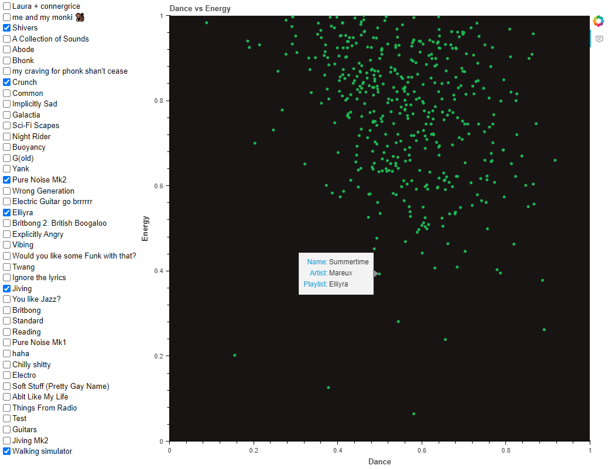
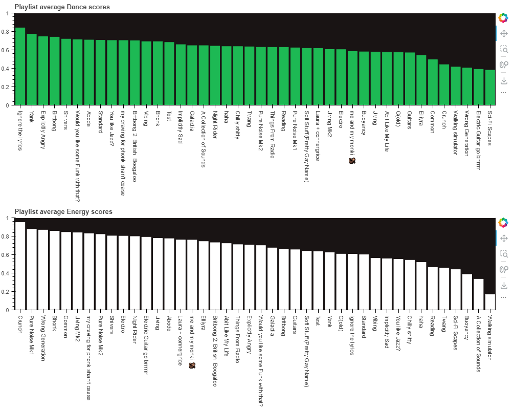
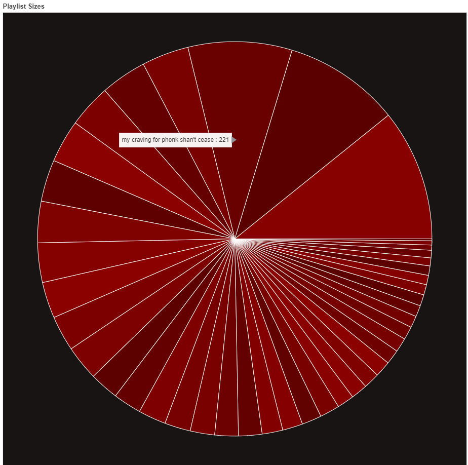

# Spotify-Extractor

A Python system that can fetch all of the users Spotify playlist data, create a database, then use that database to plot a few diagrams visualising what type of songs the user has saved. The main libraries used in the program are, Spotipy, in order to communicate with the official Spotify API, SQLite3 is used to generate and fill a local database, and Bokeh, a browser based visualisation library for generating the diagrams.

## Project Description

When I first started learning basic OOP principles I decided to write this program to understand the concepts on a deeper level. This is the first program I have written trying to follow the OOP paradigm. As a result I have tried to implement classes as much as possible. This includes using Python's data classes as well as abstract base classes where possible. Another reason for this project is to learn about relational database design. This was done by designing by own database.

The first main program file is `get_data.py`. This script is responsible for creating the database that will be used to store all the user data fetched by the Spotify API. The next component is the `update_data.py` file. This program is used when the user wants to update the already generated database, if, for example, they have modified, added, or deleted any of their playlists after running the initial `get_data.py` script. Finally, the `show_data.py` file is used to generate the visualisations by collecting the data from the database and showing them in a internet browser.

There are 3 different visualisations that are generated. The first is a scatter plot showing the relation to a songs _danceability_ metric to its _energy_ metric. The next are two bar charts giving the average _danceability_ and _energy_ scores for each playlist that is present on the users account. The final graph is a simple pie chart visualising the size of each of the users playlists.

_Danceability_ and _energy_ are metrics used and defined at [Spotify](https://developer.spotify.com/documentation/web-api/reference/#/operations/get-several-audio-features) as:

Feature|Explanation
---|---
Danceability|Danceability describes how suitable a track is for dancing based on a combination of musical elements including tempo, rhythm stability, beat strength, and overall regularity. A value of 0.0 is least danceable and 1.0 is most danceable.
Energy|Energy is a measure from 0.0 to 1.0 and represents a perceptual measure of intensity and activity. Typically, energetic tracks feel fast, loud, and noisy. For example, death metal has high energy, while a Bach prelude scores low on the scale. Perceptual features contributing to this attribute include dynamic range, perceived loudness, timbre, onset rate, and general entropy.

### Danceability - Energy Scatter Plot

This plot will contain a point for every song in all the playlists on the users account. However, It is interactive in the fact that the user can decide which songs are shown by checking which playlists to filter out. Since the songs are not labelled by default, the song name, artist, and playlist it is from can be seen by hovering over the point with the cursor.



### Danceability and Energy Bar Charts

This is not an interactive plot and will simply show the users playlists and their average danceability and energy values in descending order.



### Playlist Pie Chart

This is a minimal pie chart visualising the size of each playlist in relation to all the playlists put together. Similar to the scatter plot, since the segments of the pie are not labelled, the user can see the information being shown by hovering over the segment.



## Usage

First, the repo can be downloaded using the command:

```cmd
git clone https://github.com/ConnerGrice/Spotify-Extractor.git
```

To install the required packages, use the command:

```cmd
pip install -r requirements.txt
```

In order to communicate with the correct Spotify account, the user must first get their **Client ID**, **Client Secret**, and set their **Redirect URI**. A good resource on how this is done can be found [here](https://www.section.io/engineering-education/spotify-python-part-1/#:~:text=The%20first%20step%20is%20to,can%20be%20whatever%20you%20want.).

Once these values are available, the user must create a `cred.py` file where this data will be stored. The format of this file must be as follows:

```python
clientID = "ExampleID"
cleintSecret = "ExampleSecret"
redirectURL = "ExampleURI"
```

Where the `"Example"` strings will be specific to the user.

The main database can then be generated by running the `get_data.py` file using:

```cmd
python get_data.py
```

This may take a while depending on how much data is present on the account. Once it is finished, a database file should be created called `Database.db`

In order to visualise the data present, after opening their browser, the user can run the `show_data.py` file:

```cmd
python show_data.py
```

This will output a html file with the visualisations on called `output.hmtl`.

If the user has modified, added, or deleted any playlists after running the `get_data.py` script and would like to update their database, the `update_data.py` file can do this without having to go through the entire process again.

```cmd
python update_data.py
```

## Appendix

### Database Structure

Since I was using this as a learning opportunity for databases, I created by own, trying to make it, by definition, the highest level of Normal form as possible.

The structure of the database is as follows:

- `Playlist` table - Containing all the playlists on the account.
- `Songs` table - Containing all the songs from each playlist.
- `Artists` table - Containing all the artists pulled from the songs (no repeats).
- `Albums` table - Containing all the albums that the songs are from (no repeats).

#### Playlists

Header|Data
---|---
PlaylistID|The primary key, given by the Spotify API.
Name| Name of the playlist.
Owner|Account name which made the playlist.
Length|Number of songs in the playlist.
Version|A code given by Spotify that changes whenever the playlist is modified, used when updating database.

#### Artists

Header|Data
---|---
ArtistID|The primary key, given by Spotify API.
Name|Name of the artist.
Genre|Genre of the artist (Spotify does not give song specific genres).

#### Albums

Header|Data
---|---
ArtistID|The primary key, given by Spotify API.
Name|Name of the artist.
ReleaseDate|The release date of the album.
ArtistID|The foreign key linking an album to its artist.

#### Songs

Header|Data
---|---
SongID|Part of the compound primary key given by Spotify API.
PlaylistID|Other part of the primary key, that also links the song to the playlist is it inside of.
Name|Name of the song.
Duration|Song duration in ms.
Dance|The danceability score given by Spotify.
Tempo|The tempo of the song.
Energy|The energy score given by Spotify.
ArtistID|A foreign key linking a song to its artist.
AlbumID|A foreign key linking a song to the album it is apart of.

**NOTE**: The `Songs` table contains a compound primary key in order to distinguish between the same song in multiple playlists. Hence why, `PlaylistID` was the other part of the primary key.

## Improvements

After this project, I learnt a lot about SQL, OOP, databases, and testing. However, some things could have been done much better.

Improvement|Reason
:---:|:---
Class structure planning|I ran into lots of issues with creating classes that did similar things but not similar enough for them to be base classes of each other. However, I decided to plan out my database a lot more before programming, which can be seen in the fact that I included many attributes that I did not use as well as the `Version` attribute in the `Playlists` database that was only used for updating. This lead to a cleaning database but very messy bloated classes.
Using different plotting library|This was the first time I has used Bokeh. I chose this library since I knew that It has the ability to be interactable. To create nice looking, interactable plots using Bokeh takes some knowledge in Java Script, which I have never used. This learning curve meant that I spend a lot of time not progressing. Most of my experience in plotting comes from the Matplotlib library. If I had used this I think I could have made nicer looking graphs in a shorter amount of time. This may have also allowed me to generate a lot more plots and maybe a dashboard.
Take testing into account when planning|This is the first project I have tried creating unit tests. Overall, I found that creating the tests as I went, verifying the correct outputs was very useful. However, I found myself writing the same code over and over for each test, having to set up a dummy database containing dummy data. I think this was inefficient and could have probably been solved If I wrote my program In a way that was more easily testable.
